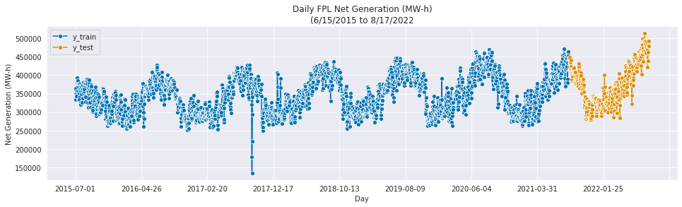

# MADS Capstone - Power Grid Protagonists

## Website
Please visit [https://www.pg-protagonists.com](https://www.pg-protagonists.com) for additional background and a detailed analysis of the results.


## Abstract
This repository represents a capstone project for the University of Michigan, Master of Applied Data Science program.

The U.S. power grid network is both interesting and incredibly complex. Governed by 70+ balancing authorities, 13,000+ power plants, 77,000+ substations, and 160,000+ miles of high-voltage power lines and millions of low-voltage power lines and distribution transformers connecting customers around the United States. The notebooks in this respository seek to achieve the following:
  - Visualize the U.S. network of power plants, substations, and balancing authorities
  - Identify potential vulnerabilities in the U.S. power grid.
  - Provide inherent risk assessment based on network measures, outages, weather events, etc.

## Data Sources
The [01_data_collection.ipynb](notebooks/01_data_collection.ipynb) notebook will download and organize all data sets from their source location. The combined size of all data sets is approximately 400MB.

The primary data sets are below:

  - Energy Information Agency (EIA)
    - [Hourly Electronic Grid Monitor](https://www.eia.gov/electricity/gridmonitor/dashboard/electric_overview/US48/US48)
  - U.S. Environmental Protection Agency (EPA) 
    - [Emissions & Generation Resource Integrated Database (eGRID)](https://www.epa.gov/egrid)
  - Department of Homeland Security (DHS)
    - [Power Plants](https://hifld-geoplatform.opendata.arcgis.com/datasets/geoplatform::power-plants-5/about)
    - [Electric Substations](https://hifld-geoplatform.opendata.arcgis.com/datasets/geoplatform::electric-substations-1/about)
    - [Electric Power Transmission Lines](https://hifld-geoplatform.opendata.arcgis.com/datasets/geoplatform::electric-power-transmission-lines-1/about)
  - Department of Energy (DOE)
    - [Major Disturbances & Unusual Occurrences](https://www.oe.netl.doe.gov/OE417_annual_summary.aspx)

## Entity Relationship Diagram
The data sources used to create the network required significant cleaning. The entity relationship diagram, post-cleaning, is included below as a reference.


## Requirements
If the notebooks are run locally, the following command will install the packages according to the configuration file [requirements.txt](requirements.txt).

```bash
# install requirements
$ pip install -r requirements.txt
```

## Notebooks
The project is designed to run the Jupyter notebooks in a specfic order to clean and enrich the original data sets as well as allow additional exploration at different stages. The notebooks can be run locally, or directly in Google Colab using the links below.

Each notebook will need access to data from the prior notebook, so if you are running in Google Colab, you will want to adjust the data storage location in the "Mount Drive" section.

1. [01_data_collection.ipynb](notebooks/01_data_collection.ipynb)
[](https://colab.research.google.com/drive/1h7_Lini_DragojOUY1e35wTTF2ahUDoC?usp=sharing)  
This notebook downloads all of the raw data sets and will create the necessary folder structure (data/raw/) in your working directory.

2. [02_data_cleaning.ipynb](notebooks/02_data_cleaning.ipynb)
[](https://colab.research.google.com/drive/13_bQOJv3PEafOUE1paOBhyunHh7WTWZY?usp=sharing)  
This notebook performs various cleaning activities on the raw data sets, including cross-referencing to ensure there are proper primary and foreign keys amongst them.

3. [03_network_analysis.ipynb](notebooks/03_network_analysis.ipynb)
[](https://colab.research.google.com/drive/1SgRCiBWNVZKtddUtvYJeGxFuJ0hdKoPN?usp=sharing)  
This notebook imports the cleaned data and creates the networks for power plants and substations, and power plants and balancing authorities. It also calculates related metrics for degree centrality, betweenness centrality, and clustering coefficients, and combines those with the cleaned data.    As some of the metrics take a long time to calculate, such as betweeness centrality, pickle files are provided in the [models](models) directory and leveraged by default, although the code to re-run them is avaialble in the notebook and can be uncommented.

4. [04_electric_disturbance_events.ipynb](notebooks/04_electric_disturbance_events.ipynb)
[](https://colab.research.google.com/drive/1N-Pr-oG4TLxdJjTijiuFnTMDd8QI-mzc?usp=sharing)  
This notebook imports the cleaned data and uses that to calculate the probability of a disturbance and/or outage at the power plant, substation, and balancing authority levels. The results are combined with the cleaned data for downstream analysis.

5. [05_energy_forecasting.ipynb](notebooks/05_energy_forecasting.ipynb)
[](https://colab.research.google.com/drive/1jESIbi0HAHocTNzuyFzvh3N50Bg--qgc?usp=sharing)  
This notebook imports time series data to explore seasonality of balancing authorities and forecast energy generation and demand.

6. [06_risk_analysis.ipynb](notebooks/06_risk_analysis.ipynb)
[](https://colab.research.google.com/drive/1wFKJzp2QPBhcdu1_aX9kwhhy8INKUpj8?usp=sharing) 
This notebook leverages the metrics and analysis from prior notebooks to explore risk associated with substations and balancing authorities.

## Sample Output
Some of the visuals and information from these notebooks can be found below.

### Network


### Forecasting



### Risk


## License
This project is distributed under the [MIT License](LICENSE.md).

## Team Members
  - Paul Natland, pnatland@umich.edu
  - Garrett Woody, gwoody@umich.edu

